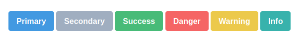

# Button

```HTML
<button class="btn btn-primary">Primary</button>
<button class="btn btn-secondary">Secondary</button>
<button class="btn btn-success">Success</button>
<button class="btn btn-danger">Danger</button>
<button class="btn btn-warning">Warning</button>
<button class="btn btn-info">Info</button>
```

# Button Outline

```HTML
<button class="btn btn-outline-primary">Primary</button>
<button class="btn btn-outline-secondary">Secondary</button>
<button class="btn btn-outline-success">Success</button>
<button class="btn btn-outline-danger">Danger</button>
<button class="btn btn-outline-warning">Warning</button>
<button class="btn btn-outline-info">Info</button>
```